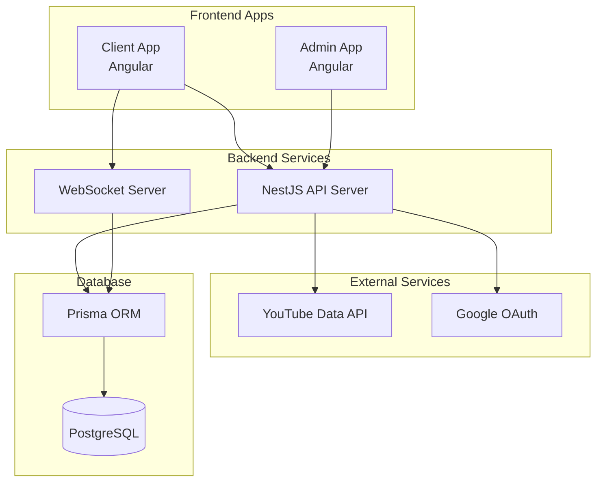

# Design Document

## Overview

유튜브 영상 재생 시스템은 NX 모노레포 구조에서 Angular 기반의 두 개 앱(Client, Admin)과 NestJS 백엔드로 구성됩니다. 실시간 WebSocket 통신을 통해 모든 사용자가 공유 대기열의 변경사항을 즉시 동기화받으며, YouTube Data API를 통해 영상 검색 및 재생 기능을 제공합니다.

## Architecture

### High-Level Architecture



### System Components

1. **Client App (apps/client)**
   - Home 페이지: 영상 재생 및 공유 대기열 관리
   - 검색 페이지: YouTube 영상 검색
   - 재생목록 페이지: 개인 재생목록 관리
   - 로그인/회원가입 페이지

2. **Admin App (apps/admin)**
   - 관리자 대시보드
   - 회원 관리 페이지
   - YouTube 프리미엄 계정 관리 페이지

3. **Backend API (apps/api)**
   - RESTful API 엔드포인트
   - WebSocket 서버
   - 인증 및 권한 관리
   - YouTube API 통합

## Components and Interfaces

### Frontend Components

#### Client App Components

```typescript
// Home Page Components
interface HomePageComponent {
  videoPlayer: VideoPlayerComponent;
  queueManager: QueueManagerComponent;
  playbackControls: PlaybackControlsComponent;
}

interface VideoPlayerComponent {
  currentVideo: Video | null;
  isPlaying: boolean;
  volume: number;
  onVideoEnd(): void;
  onPlayPause(): void;
}

interface QueueManagerComponent {
  queue: QueueItem[];
  onAddToQueue(video: Video, priority?: boolean): void;
  onRemoveFromQueue(queueId: string): void;
  onReorderQueue(fromIndex: number, toIndex: number): void;
}

// Search Components
interface SearchPageComponent {
  searchResults: Video[];
  searchQuery: string;
  onSearch(query: string): void;
  onAddToQueue(video: Video): void;
  onAddToPlaylist(video: Video, playlistId: string): void;
}

// Playlist Components
interface PlaylistPageComponent {
  playlists: Playlist[];
  selectedPlaylist: Playlist | null;
  onCreatePlaylist(name: string): void;
  onAddPlaylistToQueue(playlistId: string, priority?: boolean): void;
}
```

#### Admin App Components

```typescript
interface AdminDashboardComponent {
  userCount: number;
  activeUsers: number;
  queueStatus: QueueStatus;
}

interface UserManagementComponent {
  users: User[];
  selectedUser: User | null;
  onActivateUser(userId: string): void;
  onDeactivateUser(userId: string): void;
  onDeleteUser(userId: string): void;
}

interface PremiumAccountComponent {
  premiumAccount: GoogleAccount | null;
  onConnectGoogleAccount(): void;
  onDisconnectAccount(): void;
}
```

### Backend API Interfaces

#### REST API Endpoints

```typescript
// Authentication
POST /auth/login
POST /auth/register
POST /auth/admin/login
GET /auth/profile

// YouTube Integration
GET /youtube/search?q={query}
POST /youtube/video/{videoId}/info

// Queue Management
GET /queue
POST /queue/add
DELETE /queue/{queueId}
PUT /queue/reorder

// Playlist Management
GET /playlists
POST /playlists
GET /playlists/{playlistId}
POST /playlists/{playlistId}/videos
DELETE /playlists/{playlistId}/videos/{videoId}

// Admin Endpoints
GET /admin/users
PUT /admin/users/{userId}/status
DELETE /admin/users/{userId}
POST /admin/premium-account
GET /admin/premium-account
```

#### WebSocket Events

```typescript
// Client to Server Events
interface ClientToServerEvents {
  'queue:add': (data: AddToQueueData) => void;
  'queue:remove': (queueId: string) => void;
  'queue:reorder': (data: ReorderQueueData) => void;
  'player:play': () => void;
  'player:pause': () => void;
  'player:volume': (volume: number) => void;
  'player:next': () => void;
}

// Server to Client Events
interface ServerToClientEvents {
  'queue:updated': (queue: QueueItem[]) => void;
  'player:state': (state: PlayerState) => void;
  'player:video-changed': (video: Video) => void;
  'user:joined': (user: User) => void;
  'user:left': (userId: string) => void;
}
```

## Data Models

### Core Entities

```typescript
interface User {
  id: string;
  email: string;
  username: string;
  isActive: boolean;
  isAdmin: boolean;
  createdAt: Date;
  lastLoginAt: Date;
}

interface Video {
  id: string; // YouTube Video ID
  title: string;
  description: string;
  thumbnail: string;
  duration: number; // in seconds
  channelTitle: string;
  publishedAt: Date;
}

interface QueueItem {
  id: string;
  video: Video;
  addedBy: User;
  addedAt: Date;
  position: number;
  isPriority: boolean;
}

interface Playlist {
  id: string;
  name: string;
  userId: string;
  videos: PlaylistVideo[];
  createdAt: Date;
  updatedAt: Date;
}

interface PlaylistVideo {
  id: string;
  playlistId: string;
  video: Video;
  position: number;
  addedAt: Date;
}

interface PremiumAccount {
  id: string;
  googleAccountId: string;
  email: string;
  accessToken: string;
  refreshToken: string;
  isActive: boolean;
  createdAt: Date;
}

interface PlayerState {
  currentVideo: Video | null;
  isPlaying: boolean;
  volume: number;
  currentTime: number;
  queue: QueueItem[];
}
```

### Database Schema (Prisma)

```prisma
model User {
  id          String   @id @default(cuid())
  email       String   @unique
  username    String   @unique
  password    String
  isActive    Boolean  @default(true)
  isAdmin     Boolean  @default(false)
  createdAt   DateTime @default(now())
  lastLoginAt DateTime?
  
  playlists   Playlist[]
  queueItems  QueueItem[]
  
  @@map("users")
}

model Video {
  id           String @id // YouTube Video ID
  title        String
  description  String?
  thumbnail    String
  duration     Int
  channelTitle String
  publishedAt  DateTime
  
  queueItems      QueueItem[]
  playlistVideos  PlaylistVideo[]
  
  @@map("videos")
}

model QueueItem {
  id         String   @id @default(cuid())
  videoId    String
  userId     String
  position   Int
  isPriority Boolean  @default(false)
  addedAt    DateTime @default(now())
  
  video Video @relation(fields: [videoId], references: [id])
  user  User  @relation(fields: [userId], references: [id])
  
  @@map("queue_items")
}

model Playlist {
  id        String   @id @default(cuid())
  name      String
  userId    String
  createdAt DateTime @default(now())
  updatedAt DateTime @updatedAt
  
  user   User            @relation(fields: [userId], references: [id])
  videos PlaylistVideo[]
  
  @@map("playlists")
}

model PlaylistVideo {
  id         String   @id @default(cuid())
  playlistId String
  videoId    String
  position   Int
  addedAt    DateTime @default(now())
  
  playlist Playlist @relation(fields: [playlistId], references: [id])
  video    Video    @relation(fields: [videoId], references: [id])
  
  @@unique([playlistId, videoId])
  @@map("playlist_videos")
}

model PremiumAccount {
  id             String   @id @default(cuid())
  googleAccountId String  @unique
  email          String
  accessToken    String
  refreshToken   String
  isActive       Boolean  @default(true)
  createdAt      DateTime @default(now())
  
  @@map("premium_accounts")
}
```

## Real-time Communication Architecture

### WebSocket Connection Management

```typescript
// WebSocket Gateway (NestJS)
@WebSocketGateway({
  cors: {
    origin: ['http://localhost:4200', 'http://localhost:4201'],
  },
})
export class QueueGateway {
  @WebSocketServer()
  server: Server;

  // Handle queue updates and broadcast to all clients
  async handleQueueUpdate(queue: QueueItem[]) {
    this.server.emit('queue:updated', queue);
  }

  // Handle player state changes
  async handlePlayerStateChange(state: PlayerState) {
    this.server.emit('player:state', state);
  }
}
```

### State Synchronization Strategy

1. **Queue State Management**
   - 서버에서 단일 진실 소스(Single Source of Truth) 유지
   - 모든 변경사항은 서버를 통해 처리
   - WebSocket을 통해 모든 클라이언트에 실시간 브로드캐스트

2. **Player State Synchronization**
   - 재생/일시정지 상태 동기화
   - 볼륨 설정 동기화
   - 현재 재생 시간 주기적 동기화 (5초마다)

3. **Conflict Resolution**
   - 동시 수정 시 서버 타임스탬프 기준으로 처리
   - 낙관적 업데이트 후 서버 응답으로 최종 확정

## YouTube Integration

### YouTube Data API Integration

```typescript
@Injectable()
export class YouTubeService {
  private readonly apiKey = process.env.YOUTUBE_API_KEY;
  
  async searchVideos(query: string, maxResults = 25): Promise<Video[]> {
    const response = await this.httpService.get(
      `https://www.googleapis.com/youtube/v3/search`,
      {
        params: {
          part: 'snippet',
          q: query,
          type: 'video',
          maxResults,
          key: this.apiKey,
        },
      }
    ).toPromise();
    
    return this.mapYouTubeResponse(response.data);
  }
  
  async getVideoDetails(videoId: string): Promise<Video> {
    const response = await this.httpService.get(
      `https://www.googleapis.com/youtube/v3/videos`,
      {
        params: {
          part: 'snippet,contentDetails',
          id: videoId,
          key: this.apiKey,
        },
      }
    ).toPromise();
    
    return this.mapVideoDetails(response.data.items[0]);
  }
}
```

### Premium Account Integration

```typescript
@Injectable()
export class PremiumAccountService {
  async authenticateWithGoogle(code: string): Promise<PremiumAccount> {
    // Google OAuth 토큰 교환
    const tokens = await this.googleAuth.getToken(code);
    
    // 사용자 정보 조회
    const userInfo = await this.googleAuth.getUserInfo(tokens.access_token);
    
    // 프리미엄 계정 저장
    return this.prisma.premiumAccount.upsert({
      where: { googleAccountId: userInfo.id },
      create: {
        googleAccountId: userInfo.id,
        email: userInfo.email,
        accessToken: tokens.access_token,
        refreshToken: tokens.refresh_token,
      },
      update: {
        accessToken: tokens.access_token,
        refreshToken: tokens.refresh_token,
        isActive: true,
      },
    });
  }
}
```

## Error Handling

### Client-Side Error Handling

```typescript
// Global Error Handler
@Injectable()
export class GlobalErrorHandler implements ErrorHandler {
  handleError(error: any): void {
    if (error instanceof HttpErrorResponse) {
      this.handleHttpError(error);
    } else if (error instanceof WebSocketError) {
      this.handleWebSocketError(error);
    } else {
      this.handleGenericError(error);
    }
  }
  
  private handleHttpError(error: HttpErrorResponse) {
    switch (error.status) {
      case 401:
        this.router.navigate(['/login']);
        break;
      case 403:
        this.notificationService.showError('접근 권한이 없습니다.');
        break;
      case 500:
        this.notificationService.showError('서버 오류가 발생했습니다.');
        break;
    }
  }
}
```

### Server-Side Error Handling

```typescript
// Global Exception Filter
@Catch()
export class AllExceptionsFilter implements ExceptionFilter {
  catch(exception: unknown, host: ArgumentsHost) {
    const ctx = host.switchToHttp();
    const response = ctx.getResponse<Response>();
    const request = ctx.getRequest<Request>();
    
    let status = HttpStatus.INTERNAL_SERVER_ERROR;
    let message = 'Internal server error';
    
    if (exception instanceof HttpException) {
      status = exception.getStatus();
      message = exception.message;
    } else if (exception instanceof YouTubeApiException) {
      status = HttpStatus.BAD_GATEWAY;
      message = 'YouTube API 오류가 발생했습니다.';
    }
    
    response.status(status).json({
      statusCode: status,
      timestamp: new Date().toISOString(),
      path: request.url,
      message,
    });
  }
}
```

## Testing Strategy

### Unit Testing

1. **Frontend Components**
   - Angular Testing Utilities 사용
   - 컴포넌트 로직 및 템플릿 테스트
   - WebSocket 연결 모킹

2. **Backend Services**
   - Jest 프레임워크 사용
   - 서비스 로직 단위 테스트
   - 외부 API 모킹 (YouTube API, Google OAuth)

### Integration Testing

1. **API Integration Tests**
   - Supertest를 사용한 HTTP 엔드포인트 테스트
   - 데이터베이스 연동 테스트 (Test DB 사용)

2. **WebSocket Integration Tests**
   - Socket.io 클라이언트를 사용한 실시간 통신 테스트
   - 다중 클라이언트 시나리오 테스트

### End-to-End Testing

1. **User Journey Tests**
   - 사용자 로그인부터 영상 재생까지 전체 플로우
   - 실시간 동기화 시나리오 테스트

2. **Admin Functionality Tests**
   - 관리자 기능 전체 플로우
   - 회원 관리 및 프리미엄 계정 설정 테스트

## Security Considerations

### Authentication & Authorization

1. **JWT Token Management**
   - Access Token (15분) + Refresh Token (7일) 전략
   - 토큰 자동 갱신 메커니즘

2. **Role-Based Access Control**
   - 일반 사용자 vs 관리자 권한 분리
   - API 엔드포인트별 권한 검증

### Data Protection

1. **Input Validation**
   - 모든 사용자 입력에 대한 검증 및 새니타이징
   - SQL Injection 방지 (Prisma ORM 사용)

2. **Rate Limiting**
   - API 호출 제한 (사용자당 분당 100회)
   - YouTube API 할당량 관리

### External API Security

1. **API Key Management**
   - 환경 변수를 통한 API 키 관리
   - 프로덕션 환경에서 키 로테이션

2. **OAuth Token Security**
   - 토큰 암호화 저장
   - 토큰 만료 시 자동 갱신

## Performance Optimization

### Frontend Optimization

1. **Lazy Loading**
   - 페이지별 모듈 지연 로딩
   - 이미지 지연 로딩 (썸네일)

2. **State Management**
   - NgRx를 사용한 상태 관리 (필요시)
   - 메모이제이션을 통한 불필요한 재렌더링 방지

### Backend Optimization

1. **Database Optimization**
   - 적절한 인덱스 설정
   - 쿼리 최적화 및 N+1 문제 해결

2. **Caching Strategy**
   - Redis를 사용한 YouTube API 응답 캐싱
   - 자주 조회되는 데이터 캐싱

3. **WebSocket Optimization**
   - 연결 풀링 및 메모리 관리
   - 불필요한 브로드캐스트 최소화